# InvoiceFlow

**Intelligent Document Processing Pipeline with GitOps & Zero-Downtime Blue-Green Deployment on GCP**

InvoiceFlow is a production-grade FastAPI microservice that automates invoice processing — extracting structured data (vendor name, line items, totals, dates) from PDF and image invoices using the Google Cloud Vision API, persisting results in Firestore, and exposing a clean REST interface. The project demonstrates a complete DevSecOps lifecycle with GitOps-based continuous delivery, zero-downtime Blue-Green deployments, and real-time observability — all on free-tier GCP infrastructure.

---

## Table of Contents

- [Problem Statement](#problem-statement)
- [Architecture](#architecture)
- [Tech Stack](#tech-stack)
- [CI/CD Pipeline](#cicd-pipeline)
- [Blue-Green Deployment Strategy](#blue-green-deployment-strategy)
- [Security (DevSecOps)](#security-devsecops)
- [Monitoring & Observability](#monitoring--observability)
- [Screenshots](#screenshots)
- [Getting Started](#getting-started)
- [API Reference](#api-reference)
- [Project Structure](#project-structure)

---

## Problem Statement

Small businesses and freelancers process hundreds of invoices manually each month — scanning, keying in vendor names, amounts, and dates into spreadsheets. This workflow is error-prone, slow, and entirely disconnected from any automated audit or compliance trail.

InvoiceFlow addresses this by combining:
- AI-driven document extraction via Google Cloud Vision API
- Policy-as-Code security enforcement (SonarQube + Trivy)
- A full GitOps lifecycle deployable on free-tier GCP infrastructure

---

## Architecture

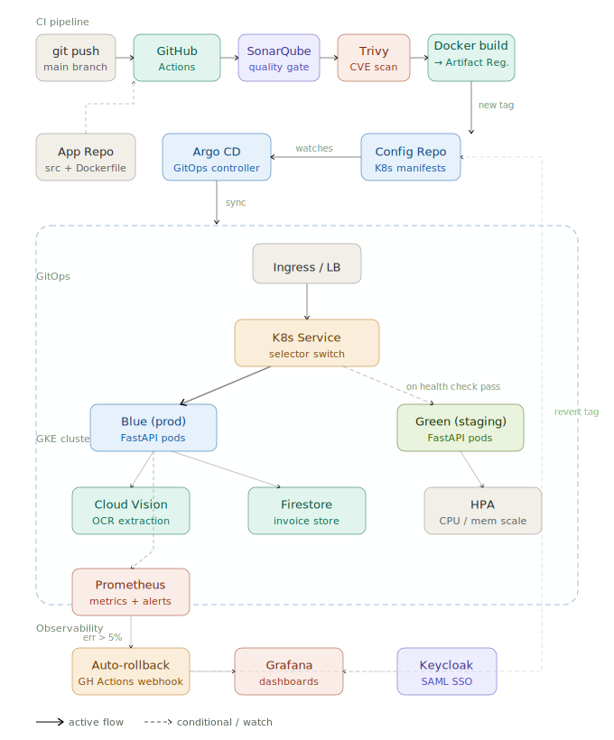

InvoiceFlow uses a **two-repo GitOps pattern**: the App Repo holds source code, Dockerfiles, and test suites; the Config Repo holds all Kubernetes manifests. Every `git push` triggers the CI pipeline, which runs tests, security scans, and a Docker build before committing a new image tag to the Config Repo. Argo CD detects the change and syncs it to the Green environment on GKE. After health checks pass, the Kubernetes Service selector switches traffic from Blue to Green for zero-downtime deployment. Prometheus monitors live error rates and triggers an automated rollback webhook if the threshold is exceeded.

---

## Tech Stack

| Tool | Purpose |
|---|---|
| Python 3.11 / FastAPI | Async REST API; Pydantic enforces invoice schema validation |
| Google Cloud Vision API | OCR extraction from PDF and image invoices (1,000 free units/month) |
| Firestore | NoSQL document store for processed invoice records |
| Docker (multi-stage) | Production image kept under 150 MB |
| GitHub Actions | CI orchestration — tests, scans, build, and Config Repo update |
| SonarQube Cloud | Static analysis; quality gate blocks the build on failure |
| Trivy | Container image CVE scanning; CRITICAL findings fail the build |
| Terraform | Provisions GKE Autopilot cluster; state in GCS |
| Argo CD | Declarative GitOps controller; watches Config Repo and syncs to GKE |
| Kubernetes / GKE Autopilot | Managed cluster with HPA scaling on CPU and memory |
| Prometheus + Grafana | Metrics scraping, alerting, and observability dashboards |
| Keycloak | SAML SSO for Argo CD and Grafana |

---

## CI/CD Pipeline

Every push to the `main` branch of the App Repo triggers the following sequential pipeline stages:

| Stage | Tool | Description |
|---|---|---|
| CI-1 | GitHub Actions | Sets up Python 3.11, installs dependencies, runs unit tests with pytest |
| CI-2 | SonarQube Cloud | Analyses code quality and coverage; pipeline blocked if quality gate fails |
| CI-3 | Trivy | Scans the Docker image for CVEs; build fails on any CRITICAL severity finding |
| CI-4 | Selenium E2E | Spins up the container locally, submits a sample invoice, asserts correct structured JSON output |
| CI-5 | Docker Build | Multi-stage Dockerfile produces a lean production image pushed to GCP Artifact Registry |
| CI-6 | Config Repo Update | Commits the new image tag into the Config Repo Kubernetes manifests |
| CD-1 | Argo CD | Detects the manifest change and syncs the updated image into the Green environment on GKE |
| CD-2 | Blue-Green Switch | After health checks pass, updates the Kubernetes Service selector to point to Green |
| CD-3 | Prometheus Alert | Monitors live error rate; if >5%, a webhook triggers GitHub Actions to revert the image tag |

---

## Blue-Green Deployment Strategy

Two identical environments — **Blue (production)** and **Green (staging)** — run simultaneously on GKE.

- Traffic is routed to Blue by default via Kubernetes Service selector
- New releases deploy to Green; Argo CD performs liveness and readiness checks
- On successful health checks, the Service selector is switched to Green with zero downtime
- **Automated rollback:** Prometheus alerts fire if the promoted environment's error rate exceeds 5%, triggering a GitHub Actions webhook that reverts the image tag in the Config Repo; Argo CD self-heals back to the stable Blue state

---

## Security (DevSecOps)

Security gates are embedded directly in the CI pipeline (shift-left approach):

- **SonarQube Cloud** — Static analysis for code quality, coverage thresholds, and duplication; any quality gate failure blocks the build
- **Trivy** — Scans the built Docker image for known CVEs; CRITICAL severity findings fail the build before any image is pushed
- **Keycloak SAML SSO** — Enterprise-grade identity federation configured for both Argo CD and Grafana, eliminating local credential management

---

## Monitoring & Observability

- **Prometheus** scrapes pod-level metrics from the `invoiceflow` namespace and fires an alert rule when the HTTP error rate exceeds 5%
- **Grafana** dashboards display CPU and memory usage for Blue and Green pods, Argo CD sync status, and request rates
- **SAML SSO** via Keycloak secures Grafana access

---

## Screenshots

### Application UI

**Dashboard**
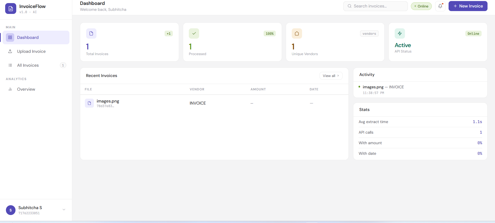

**Upload & OCR Extraction**
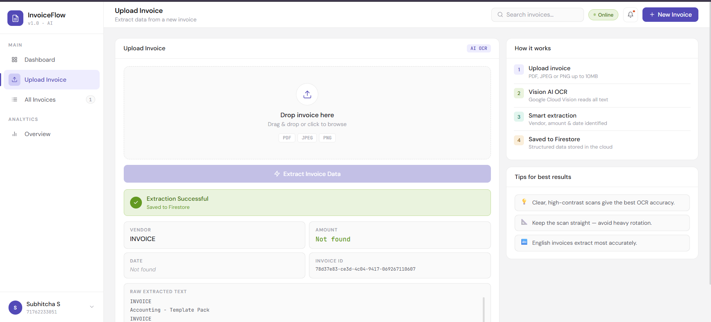

**Invoice History**
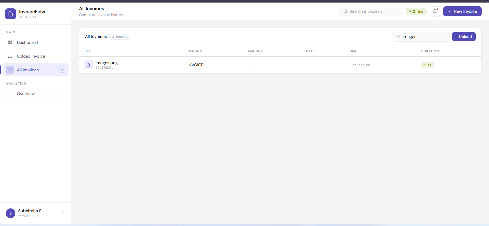

---

### CI/CD Pipeline

**GitHub Actions — all jobs green**
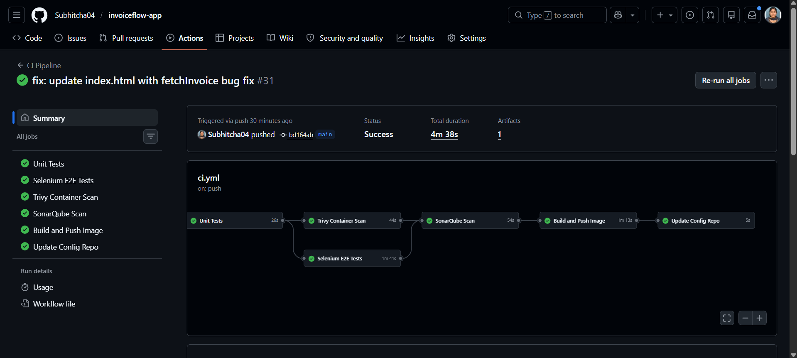

**SonarQube scan passed**
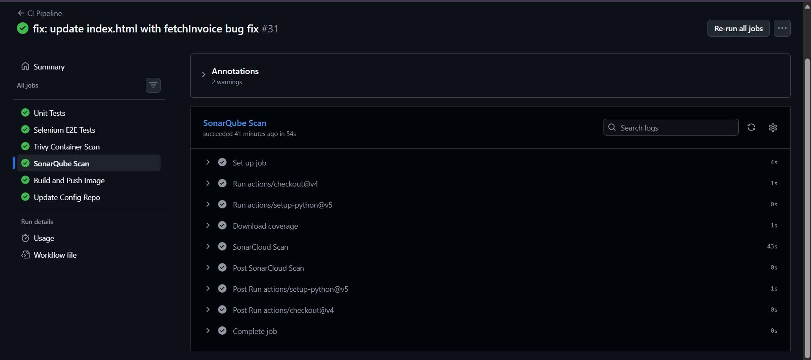

**Trivy container scan passed**
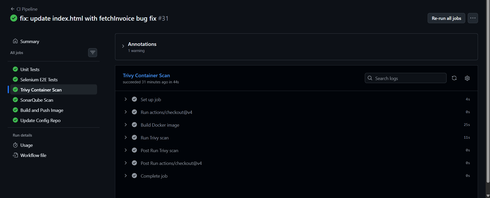

---

### GitOps & Deployment

**Argo CD — synced, auto-sync enabled, service + HPA tree**
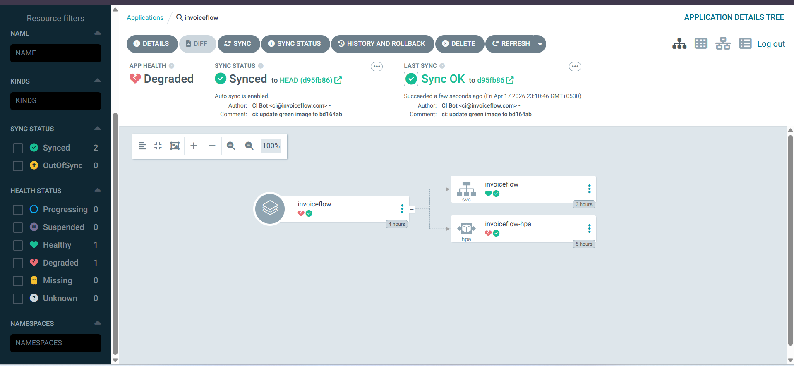

---

### Observability

**Grafana — CPU quota for blue and green pods**
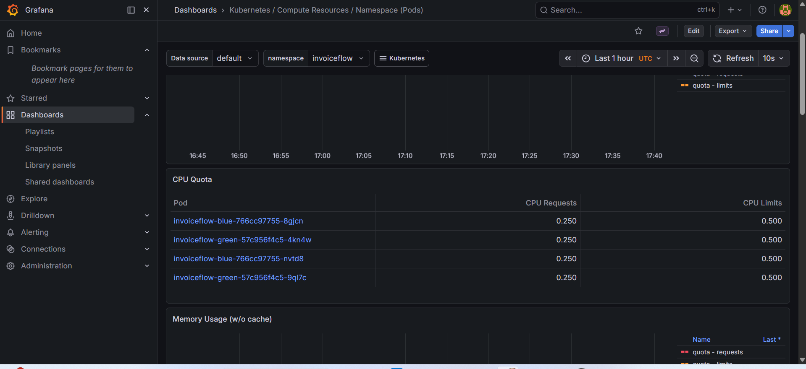

---

### GCP Infrastructure

**GKE Autopilot cluster with Managed Prometheus**
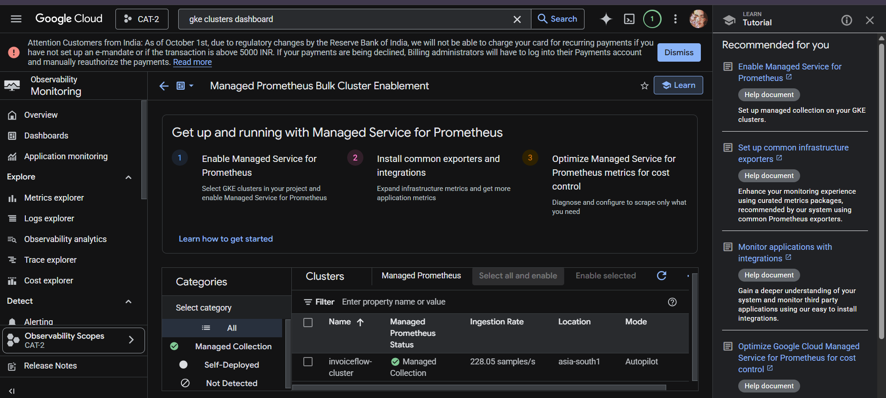

**Artifact Registry — versioned Docker images**
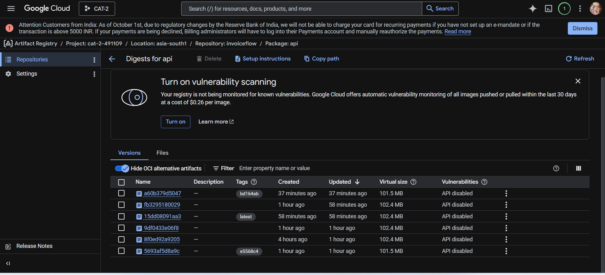

**Firestore — invoice documents**
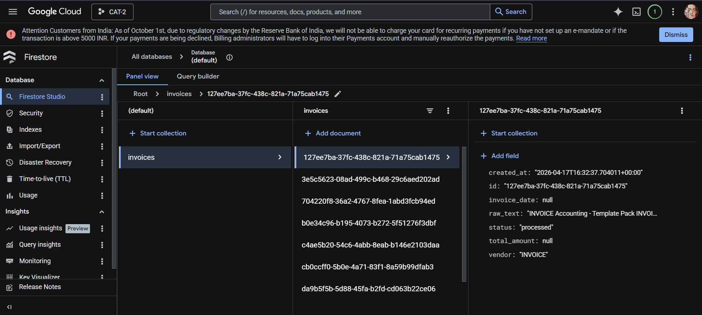

---

## Getting Started

### Prerequisites

- GCP project with billing enabled (Vision API, GKE, Firestore, Artifact Registry)
- `gcloud` CLI authenticated
- `terraform` >= 1.5
- `kubectl`
- `docker`

### 1. Provision Infrastructure

```bash
cd terraform/
terraform init
terraform apply
```

This provisions the GKE Autopilot cluster in `asia-south1` and creates the GCS backend for Terraform state.

### 2. Install Argo CD

```bash
kubectl create namespace argocd
kubectl apply -n argocd -f https://raw.githubusercontent.com/argoproj/argo-cd/stable/manifests/install.yaml
```

### 3. Configure Secrets

Set the following GitHub Actions secrets in the App Repo:

| Secret | Description |
|---|---|
| `GCP_SA_KEY` | GCP service account JSON key |
| `GCP_PROJECT_ID` | Your GCP project ID |
| `SONAR_TOKEN` | SonarQube Cloud token |
| `CONFIG_REPO_TOKEN` | GitHub PAT with write access to the Config Repo |

### 4. Run Locally

```bash
pip install -r requirements.txt
export GOOGLE_APPLICATION_CREDENTIALS=path/to/key.json
uvicorn app.main:app --reload
```

Visit `http://localhost:8000` for the dashboard or `http://localhost:8000/docs` for the OpenAPI spec.

### 5. Run Tests

```bash
pytest tests/unit/
pytest tests/e2e/   # requires a running instance
```

---

## API Reference

### `POST /invoice/upload`

Upload a PDF or image invoice for OCR extraction.

**Request:** `multipart/form-data` with a `file` field.

**Response:**
```json
{
  "id": "abc123",
  "vendor": "Acme Corp",
  "date": "2024-01-15",
  "total": 1250.00,
  "line_items": [...],
  "raw_text": "..."
}
```

### `GET /invoice/{id}`

Retrieve a previously processed invoice from Firestore.

**Response:** Same schema as above.

---

## Project Structure

```
invoiceflow/                  # App Repo
├── app/
│   ├── main.py               # FastAPI application and route definitions
│   ├── models.py             # Pydantic invoice schema
│   ├── vision.py             # Google Cloud Vision API integration
│   ├── firestore.py          # Firestore read/write operations
│   └── static/               # Frontend dashboard (HTML/CSS/JS)
├── tests/
│   ├── unit/                 # pytest unit tests
│   └── e2e/                  # Selenium end-to-end tests
├── Dockerfile                # Multi-stage build
├── requirements.txt
└── .github/
    └── workflows/
        └── ci.yml            # GitHub Actions CI/CD pipeline

invoiceflow-config/           # Config Repo
├── blue/
│   └── deployment.yaml       # Blue (production) Deployment manifest
├── green/
│   └── deployment.yaml       # Green (staging) Deployment manifest
├── service.yaml              # Kubernetes Service (selector switches between blue/green)
├── hpa.yaml                  # Horizontal Pod Autoscaler
├── ingress.yaml
└── argocd/
    └── application.yaml      # Argo CD Application definition
```

---

